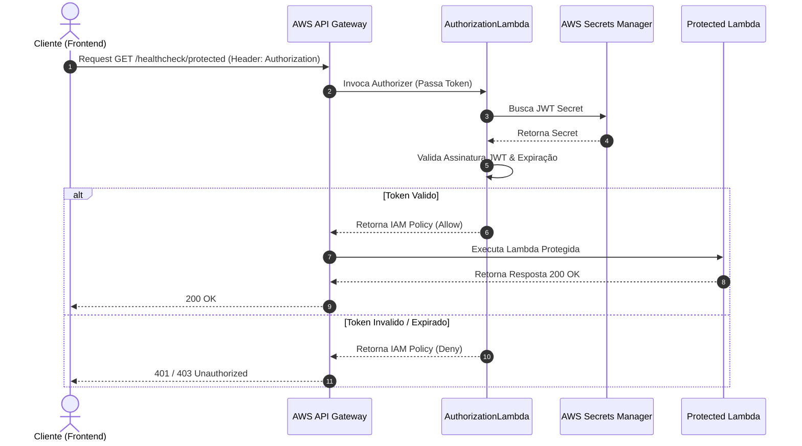

# 🗺️ LedgerOS - Documentação Completa de Rotas e Decisões Técnicas

Esta documentação apresenta em detalhes a arquitetura, o fluxo de autenticação e o catálogo completo de endpoints (rotas) da API do **LedgerOS**.

---

## 🏛️ 1. Visão Geral da Arquitetura do Backend

### 1.1 Modelo Multi-Lambda (Function-per-Route)
O **LedgerOS** utiliza a infraestrutura **AWS Serverless (SAM)** configurada com o padrão **Function-per-Route**. Em vez de agrupar todas as rotas sob um único servidor monólito (como Spring Boot), cada rota do API Gateway dispara uma função AWS Lambda isolada e independente.

#### Vantagens Técnicas:
1. **Cold Start Reduzido**: O tempo de carregamento da JVM (Java 21) é otimizado pois a função carrega apenas o pacote necessário para aquela rota específica.
2. **Escalabilidade & Resiliência Isolada**: Um pico de acessos no `/auth/login` não afeta a disponibilidade ou latência do `/healthcheck`.
3. **Políticas IAM Mínimas (Least Privilege)**: Cada Lambda possui permissões estritas no `template.yaml`. Por exemplo, apenas a `AuthorizationFunction` possui permissão de leitura no AWS Secrets Manager para a chave JWT.
4. **Alocação Inteligente de Recursos**: Memória e tempo limite de execução (*timeout*) são ajustados sob medida para cada função.

---

### 1.2 Clean Architecture (Arquitetura Limpa)
O código fonte em `backend/src/main/java/com/ledgeros/` é organizado rigorosamente em 5 camadas:

```
com.ledgeros/
├── presentation/         # DTOs de Entrada (Request), Saída (Response) e Handlers Lambda
├── application/          # Implementação dos Casos de Uso (Regras de Negócio)
├── domain/               # Entidades de Domínio (User, RefreshToken) e Interfaces de Repositório
├── infrastructure/       # Exceções globais (LambdaException, ExceptionCode)
└── shared/               # Provedores DynamoDB, Utilitários JWT, Parsers e LambdaWrapper
```

- **Handlers Decoupled**: As classes no pacote `presentation.lambda` atuam unicamente como adaptadores do protocolo API Gateway (`APIGatewayProxyRequestEvent -> APIGatewayProxyResponseEvent`).
- **Casos de Uso Isolados**: A lógica de autenticação fica em `application.auth.*UseCase`, sem dependências com os eventos do API Gateway.

---

## 🔐 2. Autenticação, Autorização e Segurança

### 2.1 Custom Authorizer (`AuthorizationLambda`)
Para proteger rotas restritas, o **AWS API Gateway** executa o `AuthorizationFunction` antes de invocar a Lambda do endpoint.



### 2.2 Tokens de Acesso vs Tokens de Atualização (JWT + Refresh Token)
- **Access Token (JWT)**: Assinado via algoritmo HMAC/RSA com a chave recuperada do AWS Secrets Manager. Possui vida curta para minimizar impactos em caso de vazamento.
- **Refresh Token (DynamoDB TTL)**: Armazenado na tabela `ledgeros-{stage}-refresh-tokens`. Utiliza a funcionalidade de **Time-To-Live (TTL)** nativa do DynamoDB. Quando o token expira, a própria infraestrutura da AWS limpa o registro sem necessidade de cronjobs ou custos de computação.

---

## 📦 3. Padronização de Requisições e Respostas

Todas as respostas HTTP seguem o envelope unificado `ApiResponse<T>` processado pela classe `LambdaWrapper`:

### 3.1 Resposta de Sucesso (`HTTP 200 OK`)
```json
{
  "status": "SUCCESS",
  "timestamp": "2026-08-01T18:00:00.000Z",
  "data": {
    "accessToken": "eyJhbGciOi...",
    "refreshToken": "4a2f8b..."
  },
  "code": null,
  "message": null
}
```

### 3.2 Resposta de Erro (`HTTP 4xx / 5xx`)
```json
{
  "status": "ERROR",
  "timestamp": "2026-08-01T18:00:00.000Z",
  "data": null,
  "code": "INVALID_CREDENTIALS",
  "message": "Credenciais inválidas. Verifique seu e-mail e senha."
}
```

---

## 🛣️ 4. Catálogo Detalhado de Rotas

### 🟢 Rotas de Diagnóstico (Healthcheck)

#### 1. `GET /healthcheck`
- **Handler**: `com.ledgeros.presentation.lambda.health.HealthCheckLambda`
- **Autenticação**: Pública (Nenhuma)
- **Descrição**: Verifica se o serviço está operando corretamente.
- **Exemplo de Resposta**:
  ```json
  {
    "status": "SUCCESS",
    "timestamp": "2026-08-01T18:00:00Z",
    "data": "Service is healthy"
  }
  ```

#### 2. `GET /healthcheck/protected`
- **Handler**: `com.ledgeros.presentation.lambda.health.ProtectedHealthCheckLambda`
- **Autenticação**: Requer autorizador (`Authorization: Bearer <access_token>`)
- **Descrição**: Valida se o cliente possui um token JWT válido e se a integração com o Custom Authorizer está funcional.
- **Exemplo de Resposta**:
  ```json
  {
    "status": "SUCCESS",
    "timestamp": "2026-08-01T18:00:00Z",
    "data": "Protected service is healthy. Principal: user-id-123"
  }
  ```

---

### 🔑 Rotas de Autenticação (`/auth/*`)

#### 3. `POST /auth/register`
- **Handler**: `com.ledgeros.presentation.lambda.auth.RegisterLambda`
- **Caso de Uso**: `RegisterUseCase`
- **Autenticação**: Pública
- **Corpo da Requisição (`RegisterRequest`)**:
  ```json
  {
    "name": "Maria Silva",
    "email": "maria@example.com",
    "password": "SenhaSegura123!"
  }
  ```
- **Descrição**: Valida a unicidade do e-mail, gera o hash seguro da senha via `HashProvider` e registra o novo usuário no DynamoDB na tabela `ledgeros-{stage}-users`.

---

#### 4. `POST /auth/verify-email`
- **Handler**: `com.ledgeros.presentation.lambda.auth.VerifyEmailLambda`
- **Caso de Uso**: `VerifyEmailUseCase`
- **Autenticação**: Pública
- **Corpo da Requisição (`VerifyEmailRequest`)**:
  ```json
  {
    "email": "maria@example.com",
    "verificationCode": "123456"
  }
  ```
- **Descrição**: Confirma o código de verificação enviado ao e-mail do usuário para ativar a conta.

---

#### 5. `POST /auth/login`
- **Handler**: `com.ledgeros.presentation.lambda.auth.LoginLambda`
- **Caso de Uso**: `LoginUseCase`
- **Autenticação**: Pública
- **Corpo da Requisição (`LoginRequest`)**:
  ```json
  {
    "email": "maria@example.com",
    "password": "SenhaSegura123!"
  }
  ```
- **Descrição**: Autentica as credenciais informadas. Se válidas, retorna o Access Token JWT e persiste um novo Refresh Token na tabela de tokens com TTL configurado.

---

#### 6. `POST /auth/refresh`
- **Handler**: `com.ledgeros.presentation.lambda.auth.RefreshTokenLambda`
- **Caso de Uso**: `RefreshTokenUseCase`
- **Autenticação**: Pública
- **Corpo da Requisição (`RefreshTokenRequest`)**:
  ```json
  {
    "refreshTokenId": "550e8400-e29b-41d4-a716-446655440000",
    "refreshToken": "dGhpcyBpcyBhIHJlZnJlc2ggdG9rZW4..."
  }
  ```
- **Descrição**: Emite um novo Access Token JWT sem necessidade de re-digitar a senha, desde que o Refresh Token continue válido e não expirado no DynamoDB.

---

#### 7. `POST /auth/logout`
- **Handler**: `com.ledgeros.presentation.lambda.auth.LogoutLambda`
- **Caso de Uso**: `LogoutUseCase`
- **Autenticação**: Pública
- **Corpo da Requisição (`LogoutRequest`)**:
  ```json
  {
    "refreshTokenId": "550e8400-e29b-41d4-a716-446655440000"
  }
  ```
- **Descrição**: Invalida a sessão do usuário removendo o Refresh Token ativo da base de dados.

---

#### 8. `POST /auth/forgot-password`
- **Handler**: `com.ledgeros.presentation.lambda.auth.ForgotPasswordLambda`
- **Caso de Uso**: `ForgotPasswordUseCase`
- **Autenticação**: Pública
- **Corpo da Requisição (`ForgotPasswordRequest`)**:
  ```json
  {
    "email": "maria@example.com"
  }
  ```
- **Descrição**: Solicita a redefinição de senha e envia o código de recuperação para o e-mail cadastrado.

---

#### 9. `POST /auth/reset-password`
- **Handler**: `com.ledgeros.presentation.lambda.auth.ResetPasswordLambda`
- **Caso de Uso**: `ResetPasswordUseCase`
- **Autenticação**: Pública
- **Corpo da Requisição (`ResetPasswordRequest`)**:
  ```json
  {
    "email": "maria@example.com",
    "resetCode": "654321",
    "newPassword": "NovaSenhaSegura456!"
  }
  ```
- **Descrição**: Valida o código de redefinição e atualiza a senha do usuário com um novo hash.

---

## 🗄️ 5. Tabelas no DynamoDB

1. **`ledgeros-{stage}-users`**
   - **Chave Primária**: `id` (String - UUID)
   - **Atributos principais**: `email`, `passwordHash`, `name`, `isVerified`, `createdAt`

2. **`ledgeros-{stage}-refresh-tokens`**
   - **Chave Primária**: `id` (String - UUID)
   - **Atributos principais**: `userId`, `tokenHash`, `expiresAt`, `ttl` (Unix timestamp para limpeza automática pela AWS)

---

## 🌐 6. Suporte a CORS
A API está pré-configurada no `template.yaml` para autorizar requisições do frontend (`https://ledgeros-react.vercel.app` em produção e `*` em ambiente de desenvolvimento local). 

Respostas de erro padrão do Gateway (`DEFAULT_4XX` e `DEFAULT_5XX`) também possuem os cabeçalhos de CORS injetados para evitar bloqueios de navegador caso ocorra algum erro no nível do API Gateway.
